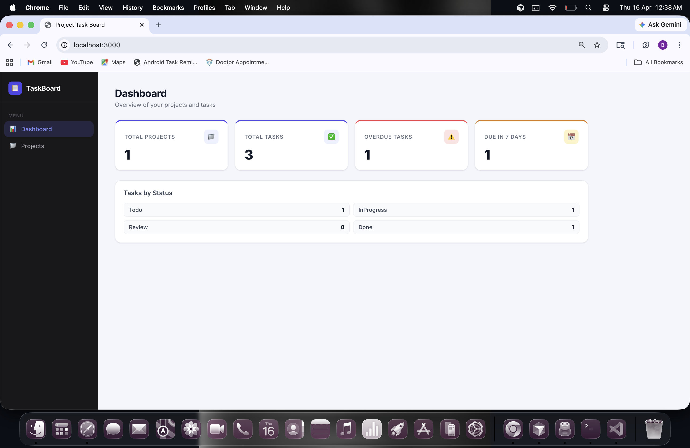
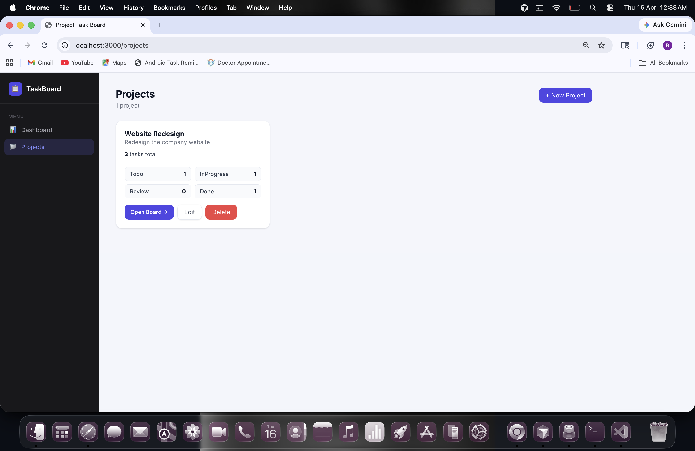
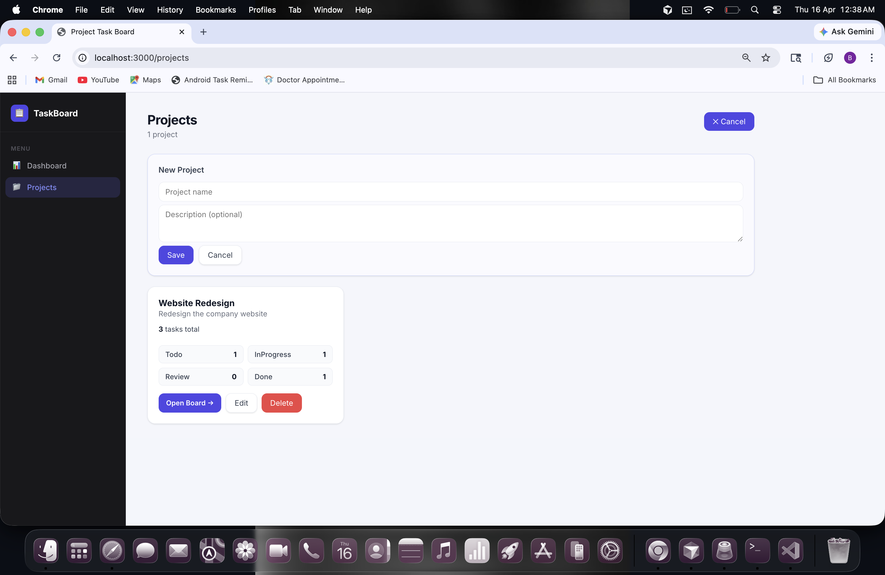
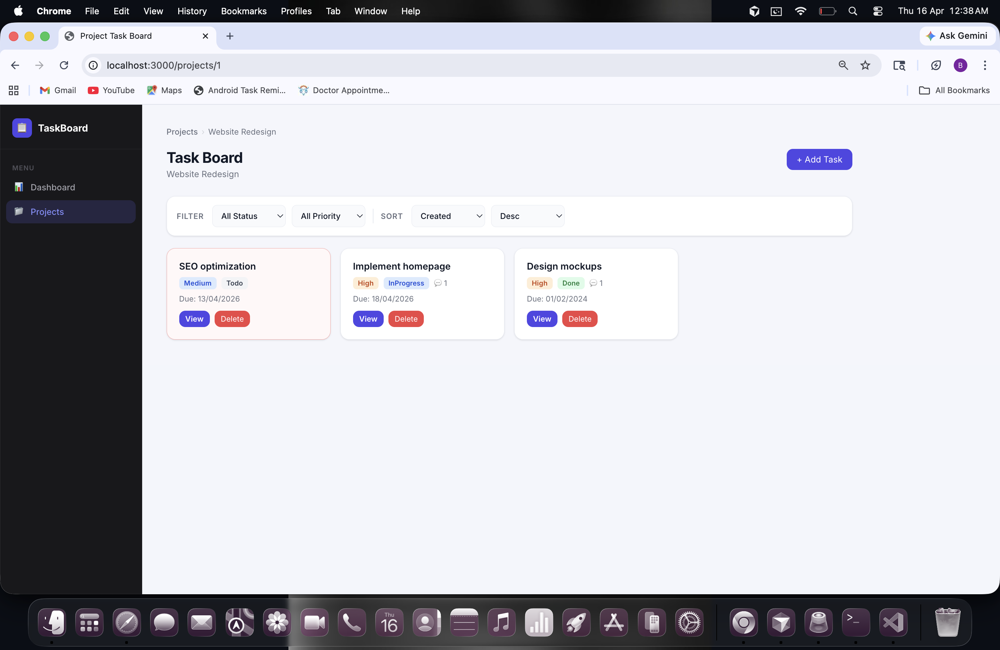
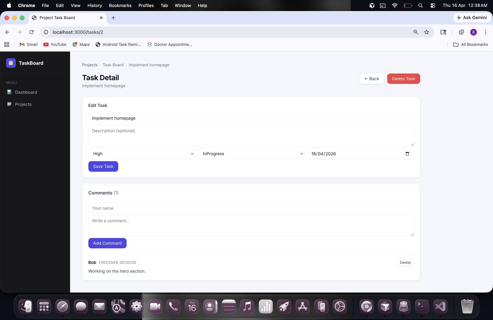
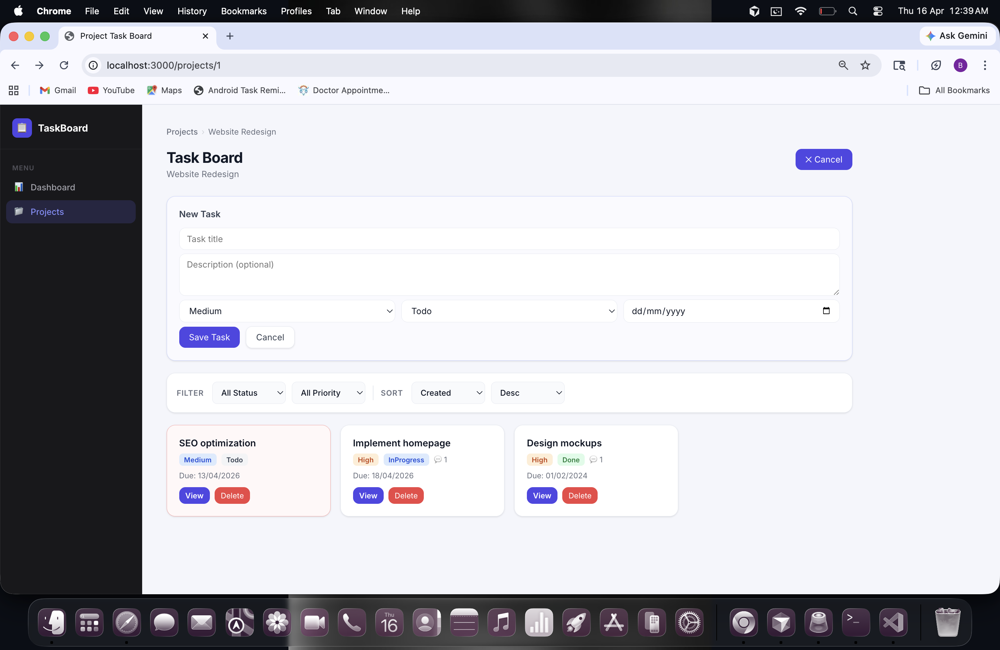

# Project Task Board

A full-stack task management application built with React + ASP.NET Core Web API + SQLite.

## Screenshots








## Features

- Create and manage projects
- Add tasks with priority, status, and due dates
- Filter and sort tasks
- Paginated task list
- Comments on tasks
- Dashboard with statistics (overdue, due this week, tasks by status)
- Global exception handling
- Seed data included

## Tech Stack

| Layer    | Technology                          |
|----------|-------------------------------------|
| Frontend | React 18, React Router v6, Axios    |
| Backend  | ASP.NET Core Web API (.NET 10)      |
| Database | SQLite via Entity Framework Core    |
| ORM      | EF Core with migrations + seed data |

## Folder Structure

```
Project-task/
├── backend/
│   └── TaskBoard.Api/
│       ├── Controllers/       # Thin API controllers
│       ├── Services/          # Business logic
│       ├── Models/            # EF Core entities
│       ├── DTOs/              # Data transfer objects
│       ├── Data/              # DbContext + SeedData
│       ├── Middleware/        # Global exception handler
│       ├── Migrations/        # EF Core migrations
│       └── Program.cs
└── frontend/
    └── src/
        ├── pages/             # DashboardPage, ProjectsPage, TaskBoardPage, TaskDetailPage
        ├── components/        # Shared, ProjectForm, TaskForm
        ├── hooks/             # useApi
        ├── context/           # NotifyContext
        ├── services/          # api.js (Axios)
        └── styles/            # main.css
```

## API Endpoints

### Projects
| Method | Endpoint              | Description        |
|--------|-----------------------|--------------------|
| GET    | /api/projects         | List all projects  |
| POST   | /api/projects         | Create project     |
| GET    | /api/projects/{id}    | Get project        |
| PUT    | /api/projects/{id}    | Update project     |
| DELETE | /api/projects/{id}    | Delete project     |

### Tasks
| Method | Endpoint                          | Description              |
|--------|-----------------------------------|--------------------------|
| GET    | /api/projects/{id}/tasks          | List tasks (filter/sort/page) |
| POST   | /api/projects/{id}/tasks          | Create task              |
| GET    | /api/tasks/{id}                   | Get task                 |
| PUT    | /api/tasks/{id}                   | Update task              |
| DELETE | /api/tasks/{id}                   | Delete task              |

### Comments
| Method | Endpoint                    | Description     |
|--------|-----------------------------|-----------------|
| GET    | /api/tasks/{id}/comments    | List comments   |
| POST   | /api/tasks/{id}/comments    | Add comment     |
| DELETE | /api/comments/{id}          | Delete comment  |

### Dashboard
| Method | Endpoint        | Description          |
|--------|-----------------|----------------------|
| GET    | /api/dashboard  | Get statistics       |

### Task Filtering & Sorting

```
GET /api/projects/1/tasks?status=InProgress&priority=High&sortBy=dueDate&sortDir=asc&page=1&pageSize=10
```

Query params: `status`, `priority`, `sortBy` (dueDate|priority|createdAt), `sortDir` (asc|desc), `page`, `pageSize`

### Paginated Response Format

```json
{
  "data": [],
  "page": 1,
  "pageSize": 10,
  "totalCount": 25,
  "totalPages": 3
}
```

## Run Instructions

### Prerequisites

- [.NET 10 SDK](https://dotnet.microsoft.com/download)
- [Node.js 18+](https://nodejs.org/)
- `dotnet-ef` tool: `dotnet tool install --global dotnet-ef`

### Backend

```bash
cd backend/TaskBoard.Api

# Restore packages
dotnet restore

# Apply migrations (creates taskboard.db with seed data)
dotnet ef database update

# Run the API on http://localhost:5000
dotnet run
```

### Frontend

```bash
cd frontend

# Install dependencies
npm install

# Start dev server on http://localhost:3000
npm run dev
```

Open [http://localhost:3000](http://localhost:3000) in your browser.

### Migration Commands

```bash
# Create a new migration
dotnet ef migrations add <MigrationName>

# Apply migrations
dotnet ef database update

# Remove last migration
dotnet ef migrations remove

# Drop database
dotnet ef database drop
```

## Data Models

### Priority Enum
`Low` | `Medium` | `High` | `Critical`

### Status Enum
`Todo` | `InProgress` | `Review` | `Done`

## Validation & Error Responses

| Code | Meaning              |
|------|----------------------|
| 200  | OK                   |
| 201  | Created              |
| 400  | Validation error     |
| 404  | Not found            |
| 409  | Duplicate name       |
| 500  | Server error         |

Validation error format:
```json
{ "errors": { "name": ["A project with this name already exists."] } }
```
